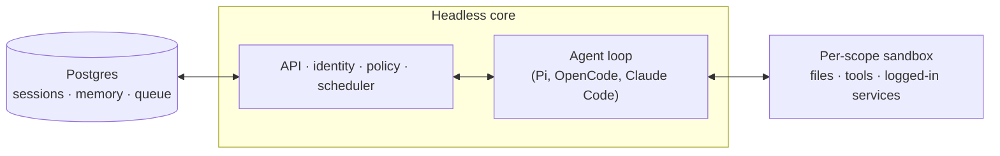

# qm

A multiplayer agent harness for work. In Slack and on the web.


## Setup

Tell your coding agent of choice `Let's deploy https://github.com/yc-software/qm`. From here, it should follow the deployment guide in this repo.

You can also try out a 3rd-party hosted version of QM [here](https://www.agent37.com/qm).

If you're an infra provider interested in offering a hosted version of QM, feel free to reach out.

## What is QM?

Most agents are designed like personal assistants. You can make one work for a whole
company, but it quickly gets complex. QM is designed for startups. Employees each get
their own isolated workspace and work independently without affecting each other, and
they can also collaborate with the agent in channels, group messages, and projects.

Each person and each room has its own scoped memory, files, keychain view, permissions,
crons, web apps, and durable sandbox.

It's built with open source in mind. Pick your own harness and model and switch between
them — Pi, OpenCode, Codex, and Claude Code all drive the same core, so a deployment
isn't tied to any single vendor.

## Features

- **Personal and shared scopes.** People customize the agent to be _theirs_, and still
  work with it collaboratively in Slack channels and projects.
- **Slack and web.** The same identity and configuration carries between Slack and the
  web app.
- **Admin control.** Set org-level configuration, security and sharing postures, and which
  harnesses and models are available.
- **Web apps.** Spin up custom internal apps and publish them to the right people.
- **Shared skills.** Skills are scope-owned and shareable by grant, with admin-gated
  promotion to the whole org and skill packs imported from git repositories.
- **Background work.** Crons, watches, and inbound webhooks run work while nobody's
  watching.

## What you can do with it

- Search internal notes, email, documents, databases, and the web together
- Build internal apps, publish them to the right people, and keep their data current
- Learn your writing voice from past sends, then triage your inbox on a schedule —
  labels and reply drafts included
- Work in an existing repository: run tests, open PRs, monitor CI, check system logs
- Track a project in a shared channel and post updates and follow-ups

## Architecture



For durability, set `DATABASE_URL` and `SESSION_STORE=postgres` — without it, sessions
live in process memory and vanish on restart. To exercise a branch end to end — core,
Slack, web, admin, portal, against a real model and real Postgres — run
`npm run dev-instance`.

## Architecture

Every turn runs through a central core, which can use a variety of models and harnesses
to generate the response. A Postgres persistence layer holds user data, session history,
and other durable state. The agent has a small, fixed tool surface; one of those tools is
`execute`, which runs commands in the scope's own isolated sandbox — its durable computer,
where installed tools stay installed. The web UI and admin panel share one service; the portal and optional built-in
auth broker share another. These modules communicate with core over its HTTP API.
See [combined services](docs/combined-services.md) for configuration and migration;
Slack is an optional in-process plugin that core starts
and supervises through a direct service client.

The core runs TypeScript directly on Node and uses Fastify for HTTP. The Slack plugin
uses Bolt; the web UI builds with Vite and renders with Lit.

The core itself is generic. Everything specific to one company — org config, custom tools
and skills, sandbox image, infrastructure — lives in a **deployment directory** that the
[`qm` CLI](./cli/README.md) validates and deploys. Every substrate (harness, session
store, sandbox, memory) sits behind an interface. Memory can also be routed by scope to
[external providers](./docs/memory-providers.md) while retaining the built-in notebook.

## Security and secrets

QM's approach follows local coding agents like OpenCode, Codex, and Claude Code: the
agent acts as the person it's working for, with their credentials and permissions, and
everything it does is audited. An org picks one security posture, which narrower scopes
can only tighten:

- **Strict** — every harness tool call pauses for human approval, except the two
  no-effect turn enders.
- **Auto** (default) — a classifier screens provenance-labelled external data and tool
  results before they reach the model; a deployment can point that at its own screening
  proxy.
- **Dangerous** — no content screening, no pauses between tool calls.

The predeclared command policy — approval rules and hard denials for things like
recursive deletes or destructive SQL — applies in every posture, Dangerous included.

Sharing posture is independent:

- **Isolated** (default) — resources stay in their scope unless explicitly shared.
- **Open** — on a live authenticated internal human turn, the speaker's opted-in personal
  files, artifacts, skills, and memory may be read in an opted-in shared room. In the
  speaker's DM, files and skills from up to 25 recent shared contexts where they are still
  a member are available. Included memories are loaded into the prompt in full with source-scope
  labels and are also searchable; relevance ranking is not applied.
  The candidate window is limited to 100 recent sessions and file discovery to 200 files.
  Binary files still require explicit sharing before entering another conversation's computer.
  Cross-context memory search is available only through the active turn's memory tool;
  reusable sandbox API tokens retain their original memory scope.

The organization value is a ceiling, and personal and room scopes can opt out; Isolated
wins. “Follow organization” removes a personal or room override. Disabled memory recall
and writable-only recall still apply. Open does not mount a personal workspace into a room, carry credentials or message
history, widen writes, run in automation or ambient turns, cross organizations, add a
teammate's entitlement, or weaken screening, command approvals, or egress. It can still
reveal private information in a shared reply, so cross-context reads are provenance-labelled
and audited.

[`SECURITY.md`](./SECURITY.md) has the threat model, the operator assumptions, and the
known limitations.

## Deploy it for your org

Create an organization-owned deployment repository that depends on `@yc-software/qm`:

```bash
npm exec --yes --package=@yc-software/qm@latest -- \
  qm init . --org <slug> --target <fly-or-aws>
npm install
```

Initialization materializes a deployment skill for an agent and walks through
infrastructure, web sign-in, connector credentials, optional Slack access, deployment,
and live verification — no source checkout required. Each deployment runs in the
operator's own cloud account; initialization does not generate or enable deployment CI,
and this repository has no production deployment workflow. See
[`deployment.md`](./deployment.md) for the details.

## Contributing

We take contributions as _human-written_ text, not code — see
[`CONTRIBUTING.md`](./CONTRIBUTING.md). Describe the change you'd like informally in a
`.txt` or `.md` file in [`adrs/`](./adrs/), and if we're aligned we'll handle the
implementation. Report vulnerabilities privately — see [`SECURITY.md`](./SECURITY.md),
not a public issue.

## Customize your instance

The deployment repository above carries config and a sandbox layer, and never needs a
source checkout. Some organizations want the opposite trade: the whole codebase in one
place, so engineers and coding agents read core and customizations together, while the
customizations themselves stay private. For that, keep a **private fork**: a standalone
private repository whose history begins as a clone of qm and whose core stays identical
to upstream.

Populate it once, then clone it to work in:

```bash
gh repo create <org>/qm-private --private

git clone --bare git@github.com:yc-software/qm qm-seed.git
git -C qm-seed.git push --mirror git@github.com:<org>/qm-private
rm -rf qm-seed.git

git clone git@github.com:<org>/qm-private
git -C qm-private remote add upstream git@github.com:yc-software/qm
```

Create the private fork with a plain clone, as shown above, and never with GitHub's fork
feature. The word "fork" here names the concept — a downstream copy that diverges
deliberately and merges from upstream — not GitHub's Fork button. A GitHub fork inherits
the visibility of the repository it came from, so a fork of a public repository cannot be
made private. A GitHub fork also shares one object network with the repository it came
from, so commits pushed to the fork stay fetchable by SHA from the public side. Many
organizations disallow forking private repositories as well. A plain clone has none of
these problems, and it costs one thing: the clone is an ordinary repository, so upstream's
CI workflows run live in your own account. Expect to supply the secrets those workflows
need, or disable the ones you do not want running.

Everything specific to your organization goes in `deploy/layers/<org>/` — config, sandbox
tools and skills, plugin images, infrastructure — in the same shape `qm init` produces. See
[`deploy/layers/README.md`](./deploy/layers/README.md). Core stays byte-identical to
upstream, which is what keeps merges small.

Two skills maintain the boundary in both directions. `update-qm` merges upstream qm into
the private fork and opens the sync PR; `upstream-pr` sends an organization-agnostic fix back to
qm, cutting the branch from `upstream/main` and checking the outgoing diff, commit
messages, and screenshots for organization identifiers before it pushes. Nothing under
`deploy/layers/` ever travels upstream.

## Going deeper

- [`docs/getting-started.md`](./docs/getting-started.md) — first run, end to end
- [`cli/README.md`](./cli/README.md) — the `qm` CLI and the deployment directory contract
- [`docs/deploy-directory.md`](./docs/deploy-directory.md) — the deployment directory in full
- [`docs/porter.md`](./docs/porter.md) — running qm on Porter
- [`.env.example`](./.env.example) — every knob, documented in place
- [`plugins/`](./plugins) — the surfaces (Slack, web UI, admin, portal)

## License

Except where otherwise noted, QM is available under the [MIT License](./LICENSE).
