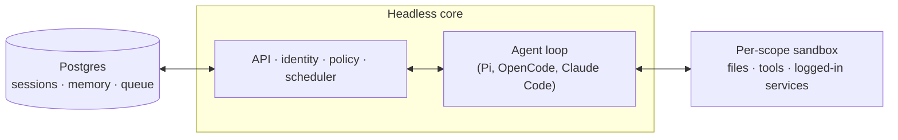

# qm

適合團隊協作的 agent harness，同時運行於 Slack 與網頁。

> 中文（繁體）版說明文件。英文原版請見 [`README.md`](./README.md)。


## QM 是什麼？

多數 agent 的設計都是個人助理。你當然可以讓一個 agent 服務整間公司，但很快就會變得複雜難管。QM 是為新創團隊設計的：每位成員都有自己隔離的工作區，可以各自獨立作業互不干擾，也可以在頻道、群組訊息與專案中與 agent 協同合作。

每個人、每個空間都擁有各自獨立的記憶、檔案、金鑰庫視野、權限、排程、網頁應用與持久化沙箱。

QM 以開源為出發點設計。你可以自行挑選 harness 與模型並隨時切換 —— Pi、OpenCode、Codex 與 Claude Code 都驅動同一套核心，因此部署不會被綁定在單一供應商上。

## 功能特色

- **個人與共享範疇。** 每個人都能把 agent 客製成「自己的」，同時又能在 Slack 頻道與專案中協同使用。
- **Slack 與網頁。** 同一份身分與設定在 Slack 與網頁應用之間無縫延續。
- **管理控制。** 設定組織層級的設定、安全等級，以及可使用哪些 harness 與模型。
- **網頁應用。** 快速建立自訂的內部應用，並發佈給合適的對象。
- **共享 skills。** Skills 由範疇擁有、可透過授權分享，並支援由管理者核可後推廣至全組織，也能從 git 儲存庫匯入 skill 套件。
- **背景工作。** 排程（cron）與監看（watch）會在無人盯著時持續執行工作。

## 你可以用它做什麼

- 同時搜尋內部筆記、電子郵件、文件、資料庫與網路
- 從公司的知識庫中取得資訊
- 建立內部應用、發佈給合適的對象，並讓其資料保持最新
- 從過往寄件學習你的書寫風格，接著定期整理你的收件匣 —— 包含標籤與回覆草稿
- 在既有的程式碼儲存庫中工作：執行測試、開 PR、監看 CI、檢查系統日誌
- 在共享頻道中追蹤專案，並發佈進度更新與後續事項

## 架構



每一輪對話都會經過中央核心，核心可以使用多種模型與 harness 來產生回應。Postgres 持久層保存使用者資料、session 歷史與其他需要長期保留的狀態。Agent 擁有一組固定而精簡的工具介面，其中一項工具是 `execute`，它會在該範疇專屬的隔離沙箱中執行指令 —— 這個沙箱就是它的持久化電腦，安裝過的工具會一直保留。網頁介面、管理後台與公開 portal 都是架在核心 HTTP API 之上的選用外掛；Slack 則是選用的行程內外掛，由核心啟動並透過直接的服務 client 進行監管。

核心以 TypeScript 直接運行於 Node，HTTP 使用 Fastify。Slack 外掛使用 Bolt；網頁介面以 Vite 建置、以 Lit 渲染。

核心本身是通用的。所有特定於單一公司的內容 —— 組織設定、自訂工具與 skills、沙箱映像檔、基礎設施 —— 都放在一個**部署目錄**中，由 [`qm` CLI](./cli/README.md) 負責驗證與部署。每一層基底（harness、session store、沙箱、記憶）都位於介面之後，因此正式環境的實作只需透過一個接線檔即可替換。

## 安全與機密

QM 的做法沿襲 OpenCode、Codex、Claude Code 這類在地端執行的 coding agent：agent 以它所服務的那個人的身分行動，使用該成員的憑證與權限，且所有行為都會被稽核。每個組織選定一種安全等級，較窄的範疇只能再收緊、不能放寬：

- **Strict（嚴格）** —— 每一次 harness 工具呼叫都會暫停等待人工核准，僅兩個無副作用的收尾工具例外。
- **Auto（自動，預設）** —— 由分類器在標註來源的外部資料與工具結果送進模型之前先行篩檢；部署方也可以將這一段指向自家的篩檢代理服務。
- **Dangerous（危險）** —— 不做內容篩檢，工具呼叫之間也不暫停。

預先宣告的指令政策 —— 針對遞迴刪除、破壞性 SQL 這類操作的核准規則與硬性封鎖 —— 在所有安全等級下皆生效，包含 Dangerous。

[`SECURITY.md`](./SECURITY.md) 記載威脅模型、對運維者的假設，以及已知的限制。

## 為你的組織部署

建立一個由組織持有、相依於 `@yc-software/qm` 的部署儲存庫：

```bash
npm exec --yes --package=@yc-software/qm@latest -- \
  qm init . --org <slug> --target <fly-or-aws>
npm install
```

初始化會產生一份給 agent 使用的部署 skill，並帶你走過基礎設施、網頁登入、連接器憑證、選用的 Slack 存取、部署與線上驗證 —— 全程不需要簽出原始碼。每個部署都運行在運維者自己的雲端帳號中；初始化不會產生或啟用部署 CI，本儲存庫也沒有正式環境的部署 workflow。細節請見 [`deployment.md`](./deployment.md)。

## 參與貢獻

我們接受的貢獻是**由人撰寫的文字**，而不是程式碼 —— 請見 [`CONTRIBUTING.md`](./CONTRIBUTING.md)。請在 [`adrs/`](./adrs/) 中以 `.txt` 或 `.md` 檔案非正式地描述你想要的變更，若方向一致，實作將由我們負責。回報安全漏洞請走私下管道 —— 見 [`SECURITY.md`](./SECURITY.md)，不要開公開 issue。

## 客製你的實例

上面提到的部署儲存庫只帶著設定與沙箱層，完全不需要簽出原始碼。有些組織想要的是相反的取捨：整個程式碼庫集中在一處，讓工程師與 coding agent 能同時讀到核心與客製內容，同時又讓客製內容維持私有。這種情況請維護一個 **private fork**：一個獨立的私有儲存庫，其歷史起始於 qm 的 clone，而核心則與上游保持一致。

先建立一次，之後 clone 下來工作：

```bash
gh repo create <org>/qm-private --private

git clone --bare git@github.com:yc-software/qm qm-seed.git
git -C qm-seed.git push --mirror git@github.com:<org>/qm-private
rm -rf qm-seed.git

git clone git@github.com:<org>/qm-private
git -C qm-private remote add upstream git@github.com:yc-software/qm
```

請如上以單純的 clone 建立 private fork，絕不要使用 GitHub 的 fork 功能。這裡的「fork」指的是概念上的下游副本 —— 一份會刻意分歧、並從上游合併的複本 —— 而不是 GitHub 的 Fork 按鈕。GitHub fork 會繼承來源儲存庫的可見性，因此公開儲存庫的 fork 無法改為私有。GitHub fork 也與來源儲存庫共用同一個 object network，所以推送到 fork 的 commit 仍可從公開端以 SHA 取得。此外，許多組織也禁止對私有儲存庫進行 fork。單純的 clone 沒有上述任何問題，代價只有一項：這個 clone 是一個普通的儲存庫，因此上游的 CI workflow 會實際在你自己的帳號中執行。請預期你需要提供這些 workflow 所需的 secrets，或是停用你不想執行的那些。

所有特定於你組織的內容都放在 `deploy/layers/<org>/` —— 設定、沙箱工具與 skills、外掛映像檔、基礎設施 —— 結構與 `qm init` 產生的相同。請見 [`deploy/layers/README.md`](./deploy/layers/README.md)。核心與上游保持逐位元組相同，這正是讓合併保持精簡的關鍵。

有兩個 skill 從兩個方向維護這條界線。`update-qm` 會把上游 qm 合併進 private fork 並開出同步 PR；`upstream-pr` 則把與組織無關的修正送回 qm，它會從 `upstream/main` 切出分支，並在推送前檢查外送的 diff、commit 訊息與截圖是否含有組織識別資訊。`deploy/layers/` 底下的任何內容都不會流向上游。

## 深入了解

- [`docs/getting-started.md`](./docs/getting-started.md) —— 第一次執行，從頭到尾
- [`cli/README.md`](./cli/README.md) —— `qm` CLI 與部署目錄的約定
- [`docs/deploy-directory.md`](./docs/deploy-directory.md) —— 部署目錄的完整說明
- [`.env.example`](./.env.example) —— 每一個設定開關，就地附上說明
- [`plugins/`](./plugins) —— 各個介面（Slack、網頁介面、管理後台、portal）

## 授權

除另有註明者外，QM 依 [MIT License](./LICENSE) 授權釋出。
